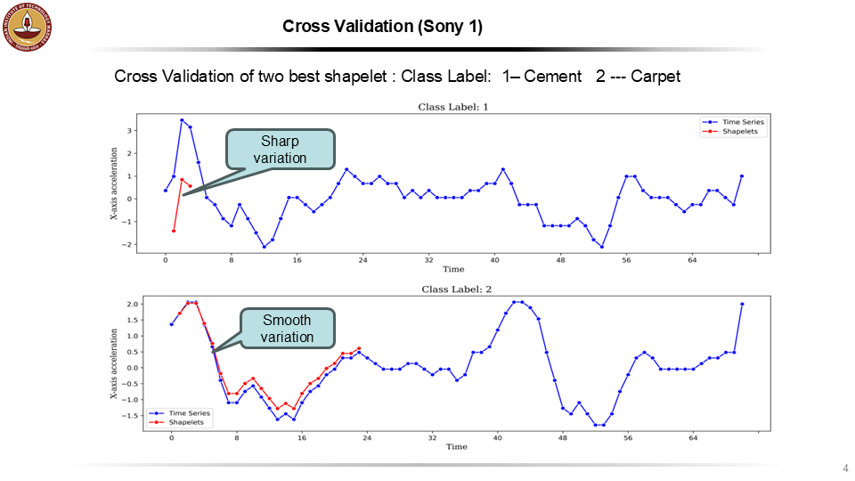

## 🚀 Installation Guide For Shapelets

### **1️ Install Anaconda Navigator**
Download and install Anaconda from the official website:  
🔗 [Anaconda Download](https://www.anaconda.com/download)


### **2 Create and Activate Virtual Environment**
Run the following commands in the **Anaconda Prompt** or **Terminal**:

```bash
conda create -n aeon-env -c conda-forge aeon
conda activate aeon-env
pip uninstall aeon
pip install -U "aeon[all_extras] @ git+https://github.com/aeon-toolkit/aeon.git@main"
```
### **3 Shapelet Demo** 
 


